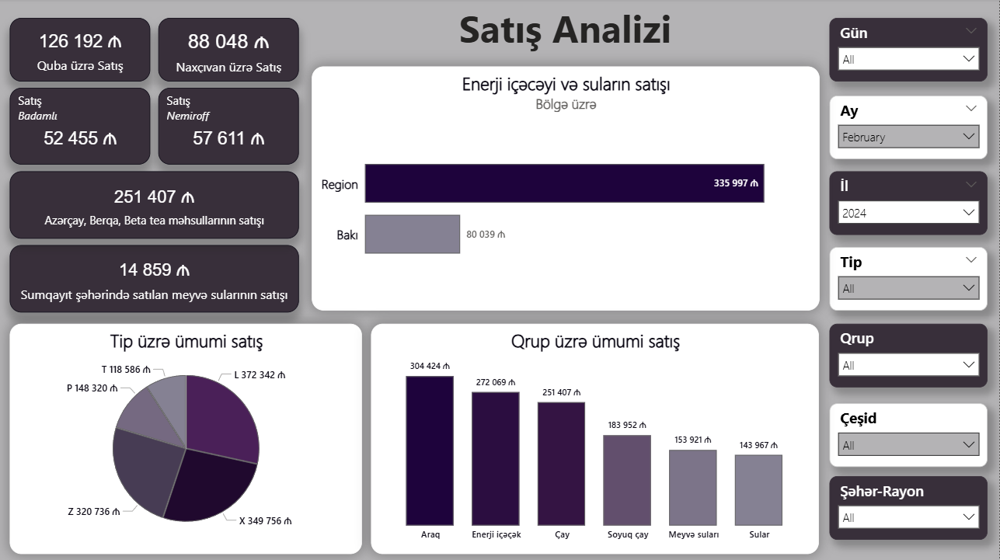

# sales-analysis-powerbi
Power BI-da satış məlumatlarının analizi və vizuallaşdırılması layihəsi

## 📌 Layihə Haqqında (Overview)
Bu layihədə şirkətin satış məlumatları analiz edilmiş, interaktiv və vizual olaraq zəngin bir Power BI dashboard-u hazırlanmışdır. Layihənin məqsədi satış trendlərini, regional performansı və məhsul kateqoriyaları üzrə gəlirliliyi izləyərək biznes qərarlarının verilməsini asanlaşdırmaqdır.

## 🛠️ İstifadə Olunan Alətlər (Tools & Technologies)
- **Power BI Desktop** – Data modelləşdirilməsi, DAX hesablamaları və vizuallaşdırma üçün.
- **Power Query (ETL)** – Məlumatların təmizlənməsi, tiplərinin nizamlanması və transformasiyası üçün.
- **DAX (Data Analysis Expressions)** – Satış, mənfəət, artım tempini hesablamaq üçün dinamik metrikaların (KPI) yaradılması.

## 📊 Əsas Göstəricilər və Tapıntılar (Key Insights)
Layihə çərçivəsində hesabatda aşağıdakı əsas istiqamətlər analiz olunub:
- **Ümumi Satış və Mənfəət:** Zaman daxilində (illik/rüblük/aylıq) satış dinamikası.
- **Regional Performans:** Coğrafi bölgələr üzrə ən çox gəlir gətirən və zəif nəticə göstərən regionların təyini.
- **Məhsul Analizi:** Ən çox satılan və ən yüksək mənfəət marjasına sahib məhsul kateqoriyaları.

## 📸 Dashboard-dan Ekran Görüntü (Screenshot)

## 🚀 Layihəni Necə Nəzərdən Keçirməli (How to Run)
1. Bu repository-ni kompüterinizə endirin (Clone və ya Download ZIP).
2. Repository daxilindəki `sales-analysis.pbix` faylını **Power BI Desktop** proqramında açaraq hesabatı interaktiv şəkildə araşdıra bilərsiniz.
